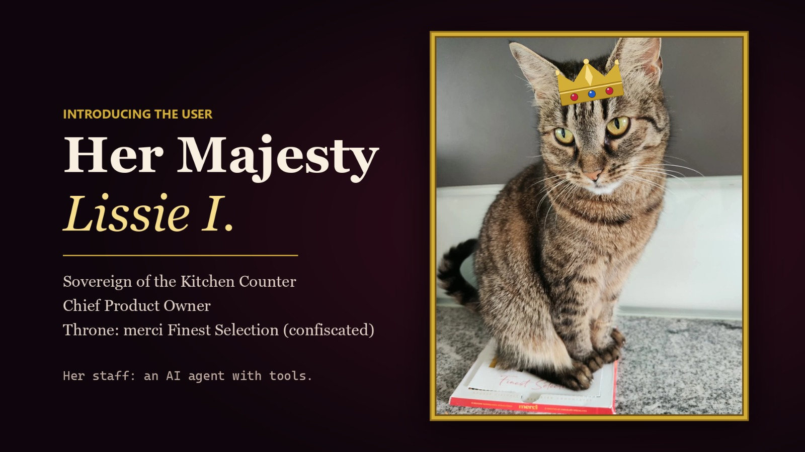
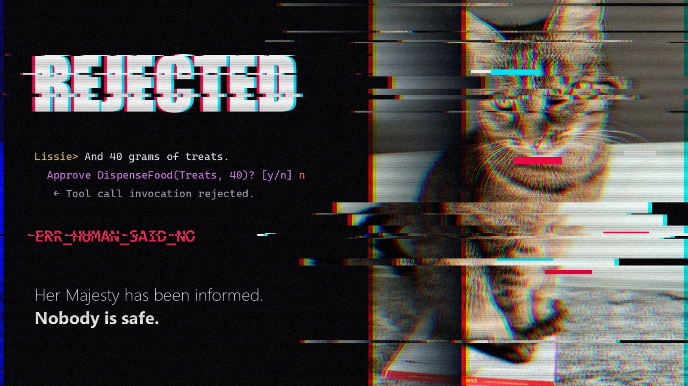

# Lissie's Staff



Demo sample for the BASTA! session *"Agents mit C# - das Microsoft Agent Framework"* (Microsoft Agent Framework, .NET 10, C# 14).
The user of the chat bot is Lissie, a cat, and the agent is her personal staff. Its tools act on the household and its two humans: Karin, the Primary Human, and Rainer, the Secondary Human.
The sample is split into eight small steps, from a first agent to a full agent behind AG-UI with tools, middleware, OpenTelemetry, MCP and A2A.

This is demo code for a talk, not production software: no authentication, in-memory state, hard-coded ports and data.

## Prerequisites

- .NET 10 SDK
- Azure CLI, logged in (`az login`) with access to an Azure OpenAI deployment that supports the Responses API
- Docker, for the standalone Aspire dashboard
- Node.js, only for the optional MCPJam commands (`npx`)

## Setup

```bash
az account show --query name -o tsv
dotnet user-secrets set AZURE_OPENAI_ENDPOINT "https://<resource>.openai.azure.com/" --project src/Lissie.Common
dotnet user-secrets set AZURE_OPENAI_DEPLOYMENT_NAME "<deployment>" --project src/Lissie.Common
dotnet build LissieAgents.slnx
scripts/start-backends.sh
```

All projects share one user-secrets store, so you set the values once. `start-backends.sh` starts the Aspire dashboard (http://localhost:18888) in Docker, the MCP server and both A2A agents; logs go to `.logs/`. `scripts/stop-backends.sh` stops the backends, and `--all` also removes the dashboard container.

Run a step with `dotnet run --project <folder>`, for example:

```bash
dotnet run --project src/02-Tools
```

## Parts

| Folder | Shows |
|---|---|
| `src/01-HelloLissie` | `AIAgent` on the Azure OpenAI Responses API, `RunAsync`, `RunStreamingAsync`, multi-turn `AgentSession` |
| `src/02-Tools` | Function tools with `AIFunctionFactory` and `[Description]`, human-in-the-loop approval (`ApprovalRequiredAIFunction`) |
| `src/03-Middleware` | Agent-run, function-calling and `IChatClient` middleware: activity log, Karin's diet policy, protected objects, prompt-injection guard |
| `src/04-Observability` | OpenTelemetry traces, metrics and logs to the Aspire dashboard, a custom span inside a tool |
| `src/05-Mcp` | One tool implementation (`src/Lissie.SmartHome`), two hosts: in-process (`-- local`) or via the MCP server (`-- mcp`) |
| `src/06-Workflows` | Sequential workflow (`-- sequential`), a routed graph with structured-output triage and custom executors (default), Mermaid export (`-- diagram`) |
| `src/07-A2A` | Discovery via agent cards, remote A2A agents as tools of the main agent |
| `src/08-AgUi` | Finale: everything combined behind an AG-UI endpoint on http://localhost:5300 |
| `src/Lissie.Common` | Shared plumbing: model setup, persona, household tools, console chat, middleware, telemetry |
| `side/SmartHomeMcp` | HTTP MCP server (http://localhost:5101/mcp), hosting the tools from `src/Lissie.SmartHome` |
| `side/VetAgent`, `side/HumanTrackerAgent` | A2A agents on http://localhost:5201 and http://localhost:5202 |
| `side/AgUiConsole` | AG-UI console client that prints every protocol event |

Step 02 in one picture: the human in the loop said no.



For the finale, run `scripts/start-backends.sh`, then `dotnet run --project src/08-AgUi` and, in a second terminal, `dotnet run --project side/AgUiConsole`.

## Other model providers

From step 02 on, any OpenAI-compatible endpoint (Chat Completions) works in place of Azure OpenAI. Store the API key once, then set the provider per run:

```bash
dotnet user-secrets set LLM_API_KEY "<key>" --project src/Lissie.Common
LLM_PROVIDER=openai-compatible LLM_ENDPOINT=https://openrouter.ai/api/v1 LLM_MODEL=z-ai/glm-5.3-flash \
  dotnet run --project src/02-Tools
```

For Ollama, use `LLM_ENDPOINT=http://localhost:11434/v1`, a local tool-calling model and any dummy key (`LLM_API_KEY=ollama`).

## Demo script

[`storybook.md`](storybook.md) has the step-by-step demo script: commands, prompts, expected reactions and fallbacks.
